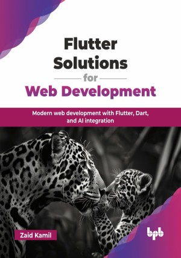

# Flutter Solutions for Web Development

Modern web development with Flutter, Dart, and AI integration.

This is the repository for [Flutter Solutions for Web Development
](https://bpbonline.com/products/flutter-solutions-for-web-development?variant=44588136169672),published by BPB Publications.

## About the Book
This book bridges the  existing web development expertise and Flutter's reactive framework, providing a clear pathway to creating engaging user experiences for the web, all powered by the robust Dart language. 

The book begins with an introduction to Dart, covering its syntax, core concepts, and control flow, before advancing into object-oriented programming, asynchronous programming, and error handling. You will learn to design stunning and responsive UIs using Flutter’s rich widget set and elevate your UI skills with advanced design techniques and animations. It then explores integrating machine learning and AI into web applications, offering practical implementations. Debugging strategies, versatile architecture patterns, and real-time backend integration ensure you build robust applications. Finally, performance optimization strategies help refine your apps for seamless and efficient user experiences.

By the end, you will be able to confidently build production-ready Flutter web apps, leverage AI for intelligent solutions, manage state efficiently, and optimize performance using industry best practices. 

## What You Will Learn
• Master Dart to write clean, efficient, and robust code.

• Develop responsive and high-performance web apps with Flutter and Dart.

• Design visually stunning UIs with animations and layout techniques.

• Integrate real-time data, AI, and ML into applications.

• Debug, test, and optimize apps for better performance and efficiency.

• Implement state management and scalable architectures for web apps.
